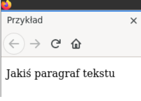

# Lekcja 1 – Markdown lekki język znaczników 
## Spis treści
1. [Wstęp](#wstęp)
 
2. [Podstawy składni](#podstawy-składni)
   
    2.1. [Definiowanie nagłówków](#definiowanie-nagłówków)
   
    2.2. [Definiowanie list](#definiowanie-list)
   
    2.3. [Wyróżnianie tekstu](#wyróżnianie-tekstu)
   
    2.4. [Tabele](#tabele)
   
    2.5. [Odnośniki do zasobów](#odnośniki-do-zasobów)
   
    2.6. [Obrazki](#obrazki)
   
    2.7. [Kod źródłowy dla różnych języków programowania](#kod-źródłowy-dla-różnych-języków-programowania)
   
    2.8. [Tworzenie spisu treści na podstawie nagłówków](#tworzenie-spisu-treści-na-podstawie-nagłówków)
   
4. [Edytory dedykowane](#edytory-dedykowane)

5. [Pandoc - system do konwersji dokumentów Markdown do innych formatów](#pandoc---system-do-konwersji-dokumentów-markdown-do-innych-formatów)

## Wstęp
Obecnie powszechnie wykorzystuje się języki ze znacznikami do opisania dodatkowych informacji
umieszczanych w plikach tekstowych. Z pośród najbardziej popularnych można wspomnieć o:
1. **html** – służącym do opisu struktury informacji zawartych na stronach internetowych,
2. **Tex** (Latex) – poznany na zajęciach język do „profesjonalnego” składania tekstów,
3. **XML** *(Extensible Markup Language)* - uniwersalnym języku znaczników przeznaczonym
do reprezentowania różnych danych w ustrukturalizowany sposób.
Przykład kodu html i jego interpretacja w przeglądarce:
<!DOCTYPE html>                                   
<html>
<head>
<meta charset="utf-8" />
<title>Przykład</title>
</head>
<body>

 Jakiś paragraf tekstu

</body>
</html>

## Podstawy składni
### Definiowanie nagłówków
### Definiowanie list
### Wyróżnianie tekstu
### Tabele
### Odnośniki do zasobów
### Obrazki
### Kod źródłowy dla różnych języków programowania
### Tworzenie spisu treści na podstawie nagłówków
## Edytory dedykowane
## Pandoc - system do konwersji dokumentów Markdown do innych formatów
